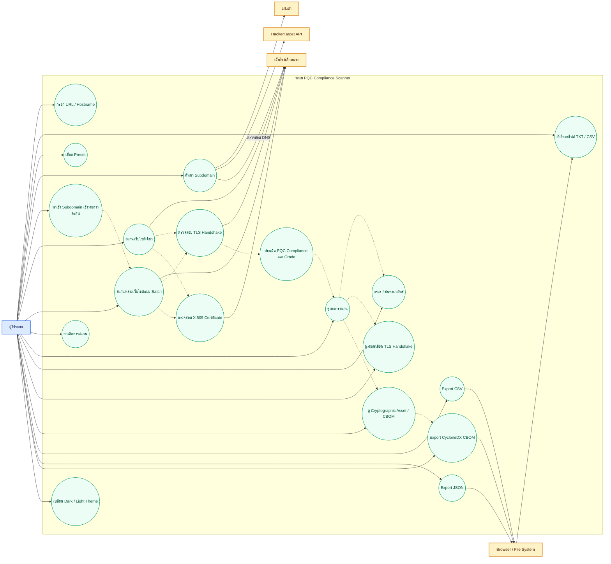

# PQC Compliance Scanner — Use Case Diagram

## ภาพรวม

ระบบ **PQC Compliance Scanner** ใช้ตรวจสอบความพร้อมด้าน Post-Quantum Cryptography (PQC) ของเว็บไซต์ วิเคราะห์ TLS handshake, key exchange และ X.509 certificate จากนั้นแสดงผลการประเมินและสร้าง Cryptography Bill of Materials (CBOM)

## Use Case Diagram

> ใช้ Mermaid flowchart แทน UML use-case notation เพื่อให้แสดงผลได้ใน Markdown viewer ทั่วไป

## Actors

| Actor | บทบาท |
|---|---|
| **ผู้ใช้ระบบ** | ป้อนเป้าหมาย สั่งสแกน ตรวจสอบผล และ Export รายงาน |
| **เว็บไซต์เป้าหมาย** | ให้บริการ TLS handshake และ X.509 certificate สำหรับตรวจสอบ |
| **crt.sh** | แหล่งข้อมูล Certificate Transparency สำหรับค้นหา subdomain |
| **HackerTarget API** | แหล่งข้อมูล passive subdomain discovery |
| **Browser / File System** | รับไฟล์นำเข้าและไฟล์รายงานที่ผู้ใช้ดาวน์โหลด |

## ความสัมพันธ์ของ Use Case สำคัญ

- **สแกนเว็บไซต์เดี่ยว** และ **สแกนหลายเว็บไซต์แบบ Batch** ใช้การตรวจสอบ **TLS Handshake** และ **X.509 Certificate**
- **TLS Handshake** ใช้ข้อมูลจากเว็บไซต์เป้าหมาย เพื่อระบุ TLS version, cipher suite และ key exchange group
- **ประเมิน PQC Compliance และ Grade** ใช้ผล key exchange, certificate และ TLS version เพื่อจัดเกรด เช่น `A++`, `A+`, `B`, `C`, `D`, `E`
- **ค้นหา Subdomain** เรียกใช้ `crt.sh`, `HackerTarget API` และตรวจสอบ DNS ได้
- **นำเข้า Subdomain เข้ารายการสแกน** ส่งผลลัพธ์ต่อไปยังการสแกนแบบ Batch
- **Export CycloneDX CBOM** ใช้ผลการสแกนเพื่อสร้างรายการ service, key exchange, TLS protocol และ certificate ตาม CycloneDX 1.6
- **ยกเลิกการสแกน** เป็นทางเลือกขณะ batch scan กำลังทำงาน

## ขอบเขตระบบ

ระบบครอบคลุมการรับรายการ URL, passive subdomain discovery, PQC/TLS analysis, certificate inspection, compliance grading, result filtering และ report export โดยไม่แก้ไข configuration ของเว็บไซต์เป้าหมาย